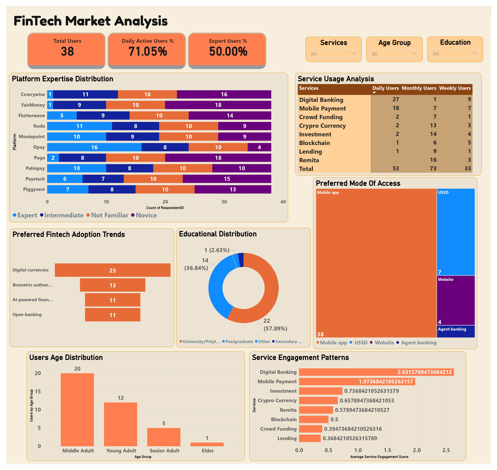

# Nigerian FinTech Market Analysis Project

## Project Overview
Comprehensive analysis of FinTech product adoption, user preferences, and market positioning in Nigeria using SQL, Power BI, and advanced data analytics techniques.

## Team Members
- Oluwatofunmi Adedayo Fak-Adeniyi (tofunmiadedayo2@gmail.com)
- Kester Ejiofobiri (kestereji@gmail.com)
- Michael Abiodun (m.abiodun130@gmail.com)
- Olamilekan Koyi (tktrades24@gmail.com)

## Key Findings

### 1. User Demographics
- Total Users: 38
- Daily Active Users: 71%
- Expert Users: 50%

#### Age Distribution
- Middle Adult: 20 users (52.6%)
- Young Adult: 12 users (31.6%)
- Senior Adult: 5 users (13.2%)
- Elder: 1 user (2.6%)

#### Educational Background
- University/Polytechnic: 22 users (57.89%)
- Postgraduate: 14 users (36.84%)
- Other Secondary: 1 user (2.63%)

### 2. Service Usage Analysis
#### Daily Active Users by Service
1. Digital Banking: 27 users
2. Mobile Payment: 18 users
3. Remita: 16 users

#### Service Engagement Scores
1. Digital Banking: 2.63
2. Mobile Payment: 1.97
3. Investment: 0.74
4. Crypto Currency: 0.66
5. Remita: 0.58
6. Blockchain: 0.50
7. Crowd Funding: 0.39
8. Lending: 0.37

### 3. Platform Adoption

#### Expert User Distribution
- Opay: 16 expert users
- Kuda: 11 expert users
- Moniepoint: 10 expert users
- PalmPay: 10 expert users
- Paystack: 6 expert users
- Flutterwave: 5 expert users

### 4. Access Preferences
- Mobile app: 38 users
- USSD: 7 users
- Website: 4 users
- Agent banking: Present but minimal usage

### 5. Emerging Technology Adoption
- Digital currencies: 15 users
- AI-powered financial services: 11 users
- Biometric authentication: 10 users
- Open banking: 9 users

## Technical Methodology

### Data Processing
1. SQL Implementation:
```sql
-- Data Cleaning and Standardization
CREATE OR ALTER VIEW vw_fintech_clean AS
WITH age_categories AS (
    SELECT 
        RespondentID,
        CASE 
            WHEN Age = '18-24' THEN 'Young Adult'
            WHEN Age = '25-34' THEN 'Middle Adult'
            WHEN Age = '35-44' THEN 'Senior Adult'
            WHEN Age = '45+' THEN 'Elder'
        END AS age_group,
        Age as original_age
    FROM fintech_response
),
service_familiarity AS (
    SELECT 
        RespondentID,
        COALESCE(Moniepoint, 'Not Familiar') as Moniepoint,
        COALESCE(Kuda, 'Not Familiar') as Kuda,
        COALESCE(Opay, 'Not Familiar') as Opay,
        COALESCE(Paystack, 'Not Familiar') as Paystack,
        COALESCE(Piggyvest, 'Not Familiar') as Piggyvest,
        COALESCE(Cowrywise, 'Not Familiar') as Cowrywise,
        COALESCE(FairMoney, 'Not Familiar') as FairMoney,
        COALESCE(Palmpay, 'Not Familiar') as Palmpay,
        COALESCE(Flutterwave, 'Not Familiar') as Flutterwave,
        COALESCE(Paga, 'Not Familiar') as Paga
    FROM fintech_response
)

SELECT 
    f.RespondentID,
    ac.age_group,
    ac.original_age,
    f.Which_of_the_following_financial_services_do_you_currently_use as current_services,
    f.Digital_Mobile_Banking as digital_banking_freq,
    f.Micro_Lending_Platforms as lending_freq,
    f.Savings_Investment_Platforms as investment_freq,
    f.Cryptocurrency_Services as crypto_freq,
    f.Blockchain_Services as blockchain_freq,
    f.Mobile_Payment as mobile_payment_freq,
    f.For_the_services_you_ve_used_how_often_do_you_use_them_Remittance_Solutions as remit_freq,
    f.Crowdfunding_Platforms as crowd_freq,
    f.FinTech_Adoption_trends as adoption_trends,
    f.Fee_Sensitivity_Score as fee_sensitivity,
    f.What_s_most_important_to_you_in_a_financial_service as priority_features,
    f.Education_Level as education,
    f.How_do_you_prefer_to_access_financial_services as access_pref,
    sf.Moniepoint, sf.Kuda, sf.Opay, sf.Paystack, sf.Piggyvest,
    sf.Cowrywise, sf.FairMoney, sf.Palmpay, sf.Flutterwave, sf.Paga
FROM fintech_response f
JOIN age_categories ac ON f.RespondentID = ac.RespondentID
JOIN service_familiarity sf ON f.RespondentID = sf.RespondentID;
```

2. Power BI Analysis:
   - User demographics visualization
   - Service engagement scoring
   - Platform adoption tracking
   - Access preference analysis

## Dashboard Access


Interactive Power BI dashboard available [here](https://app.powerbi.com/view?r=eyJrIjoiMDY2NTAxYjUtYjI1My00MDc0LTliYTgtYTZhYmNlYjJmMGMzIiwidCI6IjUxN2QzNTAyLTI5MDEtNGRlMi1hODdiLTk1YzUwN2E5YTA4OCJ9)

## Recommendations

### 1. Product Strategy
- Prioritize mobile app development (100% user preference)
- Focus on digital banking and mobile payment solutions
- Explore digital currency integration (significant user interest)
- Develop AI-powered features (shown adoption readiness)

### 2. Market Positioning
- Target educated professionals (94.73% tertiary education)
- Focus on middle and young adult segments (84.2% combined)
- Leverage high digital banking engagement

### 3. Platform Development
- Ensure robust mobile app functionality
- Integrate USSD as secondary access
- Implement biometric authentication
- Consider open banking capabilities

## Project Structure
```
├── data/
│   ├── raw_data/
│   └── processed_data/
├── sql/
│   ├── cleaning_scripts/
│   └── analysis_queries/
├── powerbi/
│   ├── dashboards/
│   └── reports/
└── documentation/
```

## Tools & Technologies
- SQL Server
- Power BI
- DAX
- Data Analysis
- Visualization Tools

## Limitations & Future Scope
- Sample size (38 users)
- Geographic distribution analysis needed
- Long-term adoption trends to be studied
